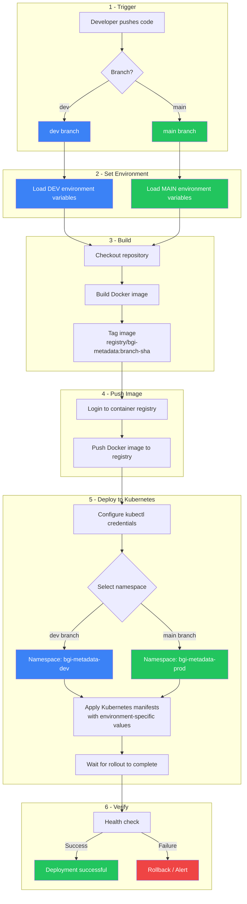

# CD Pipeline

```mermaid
flowchart TD
    subgraph Trigger["1 - Trigger"]
        A[Developer pushes code]
        A --> B{Branch?}
        B -->|dev| DEV[dev branch]
        B -->|main| MAIN[main branch]
    end

    subgraph Env["2 - Set Environment"]
        DEV --> ENV_DEV[Load DEV environment variables]
        MAIN --> ENV_MAIN[Load MAIN environment variables]
    end

    subgraph Build["3 - Build"]
        ENV_DEV --> CHECKOUT[Checkout repository]
        ENV_MAIN --> CHECKOUT
        CHECKOUT --> DOCKER_BUILD[Build Docker image]
        DOCKER_BUILD --> TAG[Tag image\nregistry/bgi-metadata:branch-sha]
    end

    subgraph Push["4 - Push Image"]
        TAG --> LOGIN[Login to container registry]
        LOGIN --> PUSH[Push Docker image to registry]
    end

    subgraph Deploy["5 - Deploy to Kubernetes"]
        PUSH --> KUBE_CONFIG[Configure kubectl credentials]
        KUBE_CONFIG --> NS{Select namespace}
        NS -->|dev branch| NS_DEV[Namespace: bgi-metadata-dev]
        NS -->|main branch| NS_MAIN[Namespace: bgi-metadata-prod]
        NS_DEV --> APPLY[Apply Kubernetes manifests\nwith environment-specific values]
        NS_MAIN --> APPLY
        APPLY --> ROLLOUT[Wait for rollout to complete]
    end

    subgraph Verify["6 - Verify"]
        ROLLOUT --> HEALTH[Health check]
        HEALTH -->|Success| DONE[Deployment successful]
        HEALTH -->|Failure| FAIL[Rollback / Alert]
    end

    style DEV fill:#3b82f6,color:#fff
    style MAIN fill:#22c55e,color:#fff
    style ENV_DEV fill:#3b82f6,color:#fff
    style ENV_MAIN fill:#22c55e,color:#fff
    style NS_DEV fill:#3b82f6,color:#fff
    style NS_MAIN fill:#22c55e,color:#fff
    style DONE fill:#22c55e,color:#fff
    style FAIL fill:#ef4444,color:#fff
```
